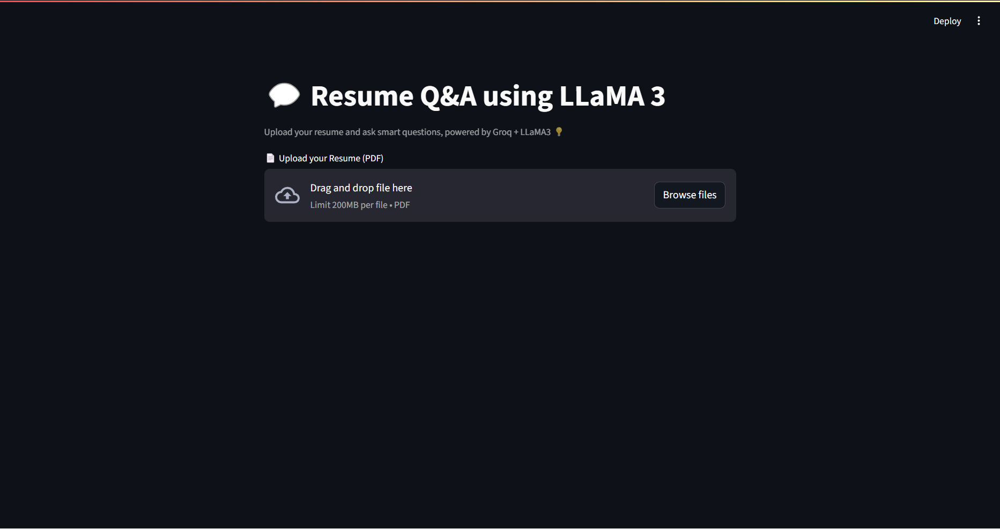

# 💬 Resume Q&A Chatbot (Groq + LLaMA3)

A simple and powerful chatbot that allows users to upload their **resume (PDF)** and ask smart questions about it! This project uses **Streamlit** for the frontend and **Groq's LLaMA3 model** for blazing fast responses 🚀

## ✨ Features

- 📄 Upload any PDF resume
- 🤖 Ask natural language questions about your resume
- 🧠 Get concise, AI-generated answers using only resume content
- ⚡ Powered by **Groq API** with **LLaMA3 (8B)** model
- 🧑‍💻 Built with Streamlit for quick and interactive UI

## 🛠 Tech Stack

- [Streamlit](https://streamlit.io/)
- [Groq API](https://console.groq.com/)
- [LLaMA3-8B-8192](https://huggingface.co/meta-llama/Meta-Llama-3-8B)
- [PyPDF2](https://pypi.org/project/PyPDF2/)

## 📦 Installation

1. Clone the repo
   git clone https://github.com/your-username/resume-chatbot.git
   cd resume-chatbot

2. Install dependencies

   pip install -r requirements.txt

3. Create a `.env` file (or directly insert the key in your script) with:

   GROQ_API_KEY=your_groq_key_here

4. Run the app

   streamlit run resume.py

## 📝 How It Works

1. Upload your **resume (PDF)**.
2. It extracts and reads the text using **PyPDF2**.
3. You can ask **any question**, like:

   * "What are my technical skills?"
   * "Summarize my work experience."
   * "Where did I intern last year?"
4. LLaMA3 responds based only on your resume content 🎯

## 🔒 Note

* This chatbot **doesn't store any data**. All processing happens live.
* Ensure your Groq API key has enough credits!

## 📸 Preview

## 🙌 Credits

* Powered by [Groq](https://groq.com/)
* Built by Gayathri as part of a GenAI project 💡
